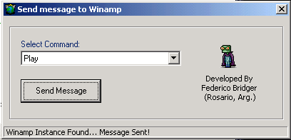



## A Class to Control Winamp\.  \(Play, Pause, Next Track, Previous Track, etc\)

### Description

Send Messages to Winamp using one simple Class Module (Play, Pause, Unpause, Next Track, Previous Track, Volume Up, Volume Down, Close, etc).

This piece of code is the best code you will ever find.

Please Vote...
 
### More Info
 
Used APIs:

FindWindow

SendMessage

             |
---                |---
**Submitted On**   |2002-05-17 21:02:10
**By**             |[Federico Bridger](https://github.com/Planet-Source-Code/PSCIndex/blob/master/ByAuthor/federico-bridger.md)
**Level**          |Intermediate
**User Rating**    |4.8 (67 globes from 14 users)
**Compatibility**  |VB 5\.0, VB 6\.0
**Category**       |[Sound/MP3](https://github.com/Planet-Source-Code/PSCIndex/blob/master/ByCategory/sound-mp3__1-45.md)
**World**          |[Visual Basic](https://github.com/Planet-Source-Code/PSCIndex/blob/master/ByWorld/visual-basic.md)
**Archive File**   |[A\_Class\_to843705172002\.zip](https://github.com/Planet-Source-Code/federico-bridger-a-class-to-control-winamp-play-pause-next-track-previous-track-etc__1-34820/archive/master.zip)

